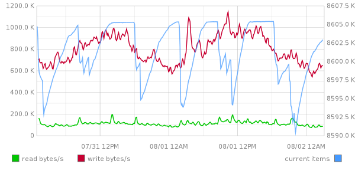

Metric++
========

Metric++ is a C++ library which provides simple metrics tracking for Windows 
applications, inspired by [statsd] metrics.

It is based on [statsd protocol], and provides C++ client library for statsd, 
as well as server implementation.

The collected metrics can be sent to various backends to analyze and process
data. E.g. they can be displayed in [graphite] or one of its numerous
[dashboards](http://dashboarddude.com/blog/2013/01/23/dashboards-for-graphite):

[statsd]: https://github.com/etsy/statsd/blob/master/docs/metric_types.md/ "statsd metrics"
[statsd protocol]: https://github.com/b/statsd_spec
[graphite]: http://graphite.wikidot.com/

Building the software
---------------------

Open the `metrics.sln` solution in Visual Studio 2010 or 2013, 
choose the appropriate configuration (see below) and build it - that's it. 

Binaries will be built in `build\` directory, in a subdirectory depending on 
configuration. E.g. if you build `Debug` configuration, you will find files in 
`build\debug` directory.

The provided solution file contains two projects: 

* `metrics` - a demo console app which contains metric++ library files
* `test` - unit tests for metric++

There are configurations both for Visual Studio 2010 and 2013: 

* use `Release` and `Debug` configurations to build on VS 2013 
* use `Release_VS2010` and `Debug_VS2010` to build on VS 2010

Metric++ is provided as a set of source code files. It is up to you to decide 
how to add it to your project: as source files, as lib/dll or something else.

### Documentation

Metric++ is thoroughly documented.

To generate the full doxygen documentation for the library, execute `build_docs.bat`
script in the project's root folder. The documentation will be generated in
directory `build\docs\html`, just open `index.html` file.

Usage
-----

Client application tracks metrics.

[Types of metrics](docs/metric_types.md)

### Setting up the client

Before writing any metrics, you need to set up the client:

~~~{.cpp}
    // setup the client
    metrics::setup_client("localhost", 9999); // point client to the server
~~~

That's it, you are ready to start tracking the metrics (assuming that server is
running). Of course, additional client settings can be specified:

~~~{.cpp}
    // setup the client, only host and port settings are required
    metrics::setup_client("localhost", 9999) // point client to the server
        .set_debug(true)                     // turn on debug tracing if you need it
        .set_namespace("myapp")              // specify metrics namespace, default is "stats"
        .track_default_metrics();            // track default system and process metrics
~~~

Now you can start tracking the metrics.

The server can easily be hosted in the same process. For more details check
'[Running the server](docs/running_server.md)'.

### Writing metrics

The library supports [3 types of metrics](docs/metric_types.md): counters, timers and gauges.

#### Timers

~~~{.cpp}
// setting a timer
void test_fn_0()
{
    int time = get_time_ms();
    // do something lengthy
    metrics::measure("app.fn.duration", get_time_ms - time);
}

// simpler:
void test_fn_1()
{
    metrics::auto_timer _("app.fn.duration");  
    // do something lengthy
}   // <- "app.fn.duration" store here when auto_timer destructor is called

// even simpler:
void test_fn_2()
{
    MEASURE_FN(); 
    // do something lengthy
}   // <- "app.fn.test_fn_2" timer stored here

~~~

#### Counters

~~~{.cpp}
void login(const char* user)
{
    metrics::inc("app.logins");           // increment login counter.
    if(!try_login(user))                  // in case of login error...
    {
       metrics::inc("app.logins.failed"); // ...increment counter of failed logins
       ...
    }
}   
~~~

Topics
------

* [How it works](docs/how_it_works.md)
* [Types of metrics](docs/metric_types.md)
* [Running the server](docs/running_server.md)
* [Protocol](docs/protocol.md)
